# ☕ COFFEE PRINCESS

> Android 기반 모바일 카페 주문 애플리케이션

COFFEE PRINCESS는 기존 카페 키오스크의 주문 기능을 모바일 애플리케이션으로 구현한 프로젝트입니다.

사용자가 카페에 직접 방문하지 않고도 모바일 환경에서 메뉴를 확인하고, 원하는 상품과 옵션을 선택하여 장바구니에 담은 뒤 결제까지 진행할 수 있도록 구현했습니다.

---

## 📱 프로젝트 소개

카페 키오스크의 주요 기능을 모바일 앱으로 구현하여 사용자의 접근성과 주문 편의성을 높이는 것을 목표로 개발했습니다.

사용자는 회원가입 및 로그인을 통해 개인 계정을 생성하고,

**메뉴 조회 → 상품 선택 → 옵션 선택 → 장바구니 → 결제**

의 과정을 거쳐 주문할 수 있습니다.

또한 회원정보 조회, 회원정보 수정, 회원 탈퇴 등의 회원 관리 기능도 제공합니다.

---

## 🎯 프로젝트 목적

모바일 앱을 통해 사용자가 언제 어디서나 카페 메뉴를 확인하고 주문할 수 있도록 하여 카페에 직접 방문하지 않고도 편리하게 주문할 수 있는 환경을 제공하는 것을 목표로 했습니다.

### 주요 목표

- 직관적인 사용자 인터페이스 구성
- 카페 메뉴 탐색 및 주문 과정 간소화
- 회원가입 및 로그인 기능 구현
- 메뉴 옵션을 통한 음료 커스터마이징
- 장바구니를 통한 주문 관리
- 결제 기능 구현
- 회원정보 조회 및 수정
- 회원 탈퇴 기능 구현

---

# ✨ 주요 기능

## 1. 회원가입

사용자는 이메일, 아이디, 비밀번호를 입력하여 회원가입할 수 있습니다.

- 이메일 / 아이디 / 비밀번호 입력
- 비밀번호 확인
- 회원정보 데이터베이스 저장
- 회원가입 성공 / 실패 처리

### 회원가입 화면

<p align="center">
  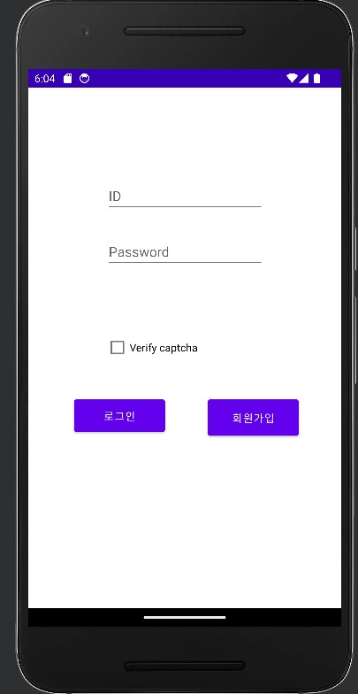
  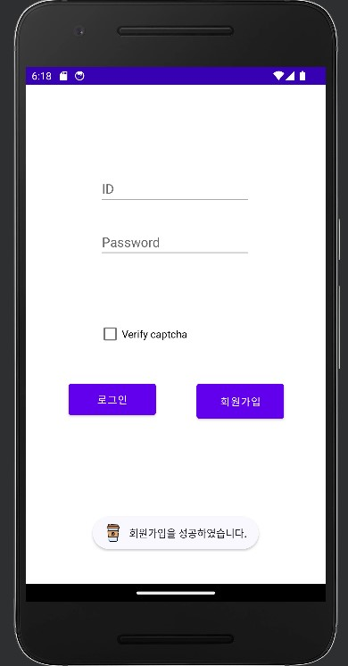
  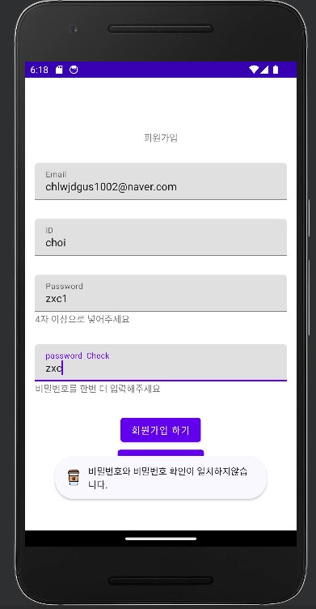
</p>

---

## 2. 로그인

등록된 계정을 이용하여 로그인할 수 있습니다.

- 아이디 및 비밀번호 입력
- 회원 데이터베이스 조회
- 로그인 성공 / 실패 처리
- CAPTCHA 인증
- 로그인 성공 후 메인 화면 이동

### 로그인 화면

<p align="center">
  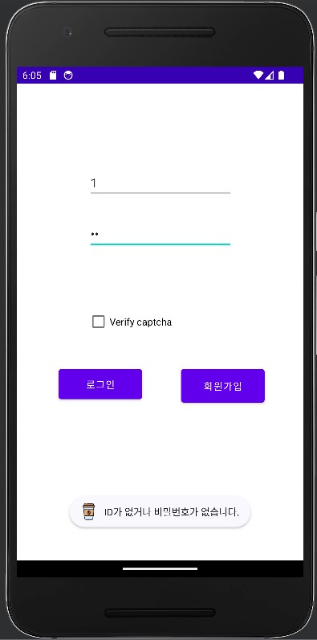
  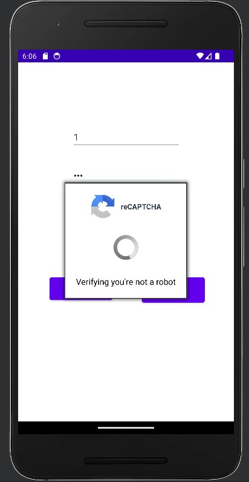
  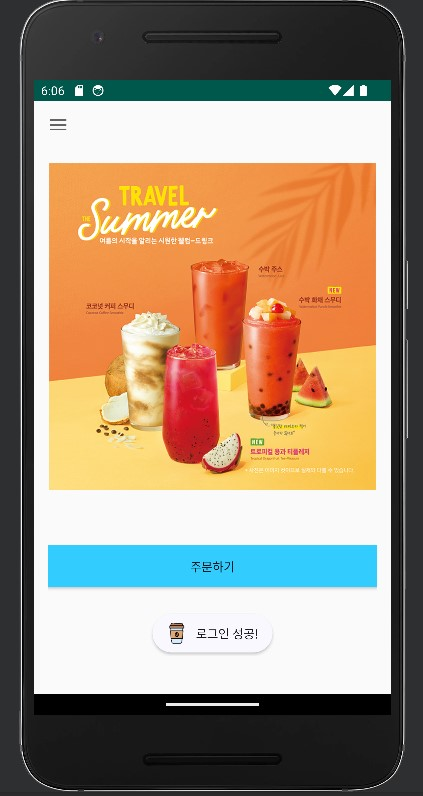
</p>

---

## 3. 회원정보 관리

로그인 후 회원 설정 메뉴를 통해 자신의 회원정보를 관리할 수 있습니다.

- 회원정보 조회
- 이메일 수정
- 비밀번호 수정
- 회원 탈퇴
- 수정 성공 / 실패 처리

### 회원 설정

<p align="center">
  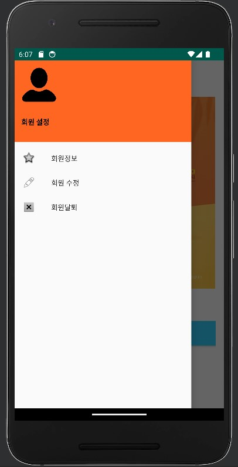
  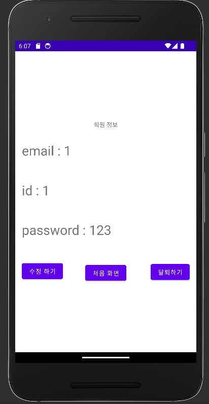
  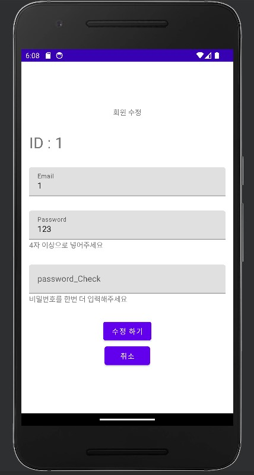
</p>

### 회원정보 수정 및 탈퇴

<p align="center">
  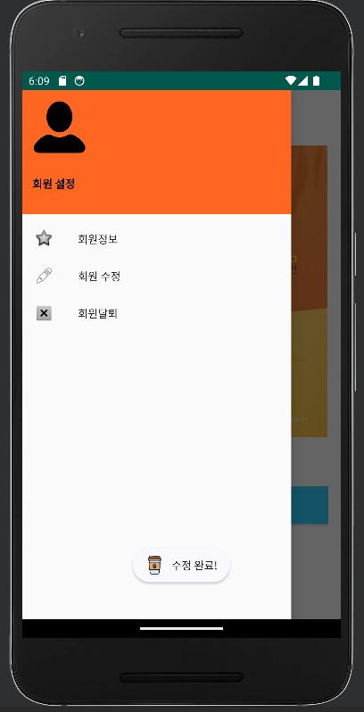
  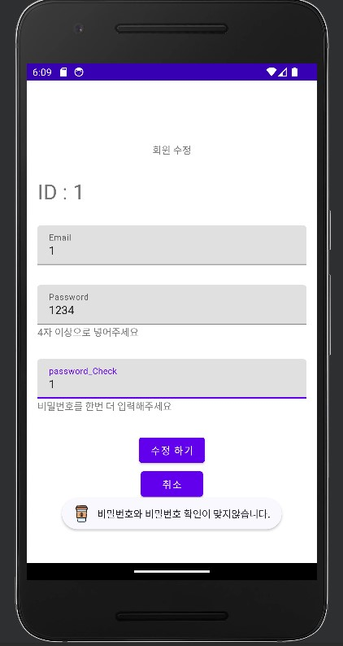
  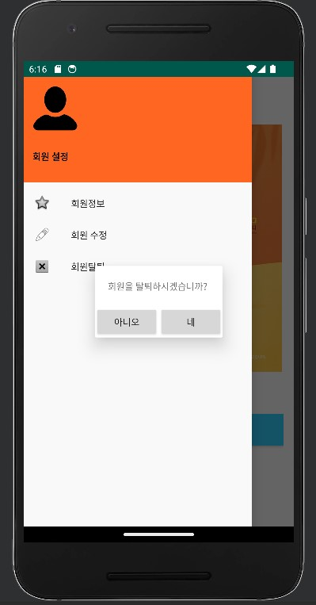
</p>

---

# 🛒 주문 기능

## 4. 상품 목록

로그인 후 주문하기를 선택하면 카페에서 판매하는 상품 목록을 확인할 수 있습니다.

메뉴는 카테고리별로 구분하여 확인할 수 있으며 상품을 선택하면 상세 주문 화면으로 이동합니다.

### 상품 목록

<p align="center">
  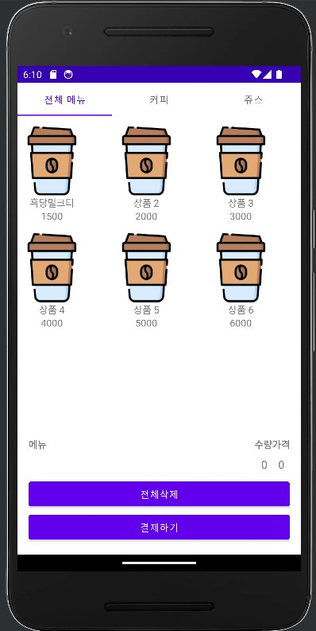
</p>

---

## 5. 상품 옵션 선택

상품을 선택하면 주문 옵션을 설정할 수 있습니다.

원하는 옵션을 선택한 뒤 상품을 장바구니에 추가할 수 있도록 구현했습니다.

### 주문 옵션

<p align="center">
  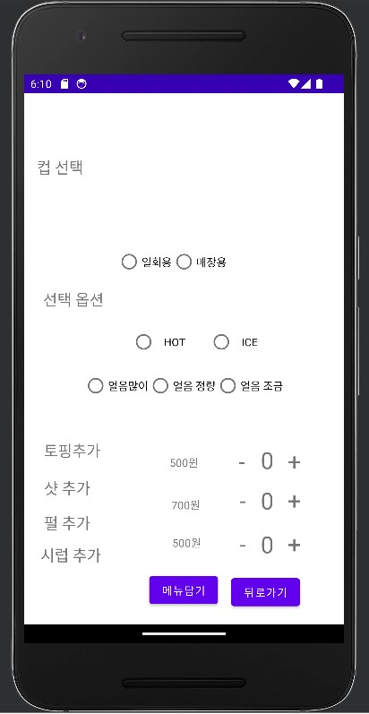
  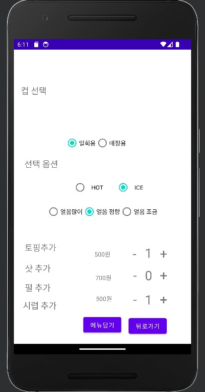
</p>

---

## 6. 장바구니

선택한 상품은 장바구니에서 확인할 수 있습니다.

- 상품 확인
- 수량 확인
- 가격 확인
- 장바구니 상품 관리
- 전체 삭제
- 결제 화면 이동

### 장바구니

<p align="center">
  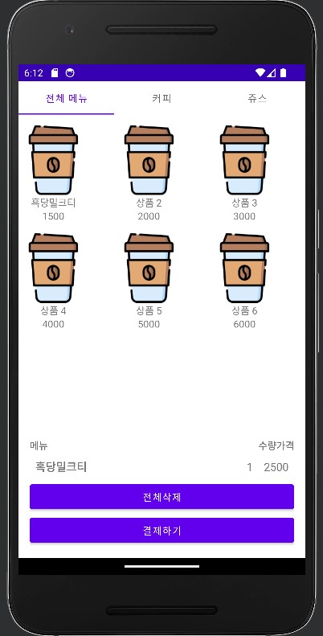
  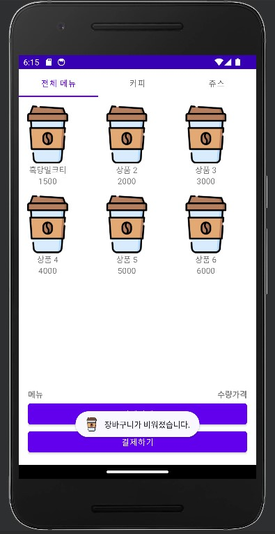
</p>

---

## 7. 결제

장바구니에 상품을 담은 후 결제를 진행할 수 있습니다.

### 주문 및 결제 흐름

```text
상품 목록
   ↓
상품 선택
   ↓
옵션 선택
   ↓
장바구니
   ↓
결제 방법 선택
   ↓
결제 완료
```

---

## 🏗️ 앱 구조

프로젝트는 Android Activity와 Fragment를 이용하여 화면을 구성하고, `RecyclerView` 기반의 Adapter를 이용하여 메뉴 및 장바구니 데이터를 표시합니다.

### 주요 클래스

```text
MainActivity
├── 회원정보 조회
├── 회원정보 수정
├── 회원 탈퇴
└── 주문 화면 이동

member_login
└── 로그인 / CAPTCHA

Register
└── 회원가입

proudct_list
├── 메뉴 카테고리
├── ViewPager
├── 장바구니
└── 결제

Fragment_1
├── 전체 메뉴
└── 상품 목록

Fragment_2
└── 상품 목록

Fragment_3
└── 기타 화면

Product
└── 상품 데이터

ProductAdapter
└── 상품 목록 출력

CartItem
└── 장바구니 데이터

CartAdapter
└── 장바구니 출력

product_detail
└── 상품 옵션 선택

credit_cart
└── 결제 처리

ordered
└── 주문 완료
```

---

## 🔥 Firebase

프로젝트에서는 **Firebase Realtime Database**를 이용하여 회원 데이터를 관리합니다.

회원가입 시 `users` 아래에 사용자 ID를 기준으로 회원정보가 저장되며, 로그인 및 회원정보 조회·수정·삭제 과정에서도 Firebase Database를 사용합니다.

```text
Firebase Realtime Database
└── users
    └── 사용자 ID
        ├── Id
        ├── email
        └── password
```

## 🛠️ 사용 기술

### Android

* Android
* Java
* Activity
* Fragment
* RecyclerView
* ViewPager
* TabLayout
* Navigation Drawer
* Intent

### Backend / Database

* Firebase Realtime Database

### Security

* Google reCAPTCHA

프로젝트 보고서에서는 Android 기반 앱 개발을 중심으로 사용자 인증, 회원관리, 주문, 주문내역 및 결제 처리 기능을 프로젝트 범위로 정의하고 있습니다.

---

## 📂 프로젝트 주요 구성

```text
app/
└── java/
    └── com.inhatc.project_android/
        ├── MainActivity.java
        ├── Register.java
        ├── member_login.java
        ├── update_member.java
        ├── view_read_member.java
        ├── member_delete.java
        ├── proudct_list.java
        ├── product_detail.java
        ├── Product.java
        ├── ProductAdapter.java
        ├── CartItem.java
        ├── CartAdapter.java
        ├── credit_cart.java
        ├── ordered.java
        ├── Fragment_1.java
        ├── Fragment_2.java
        ├── Fragment_3.java
        └── MyPagerAdapter.java
```

---

## 🔄 사용자 이용 흐름

```text
┌──────────────┐
│   앱 실행    │
└──────┬───────┘
       ↓
┌──────────────┐
│ 로그인/회원가입 │
└──────┬───────┘
       ↓
┌──────────────┐
│   메인 화면   │
└──────┬───────┘
       ↓
┌──────────────┐
│   메뉴 선택   │
└──────┬───────┘
       ↓
┌──────────────┐
│ 상품 옵션 선택 │
└──────┬───────┘
       ↓
┌──────────────┐
│   장바구니   │
└──────┬───────┘
       ↓
┌──────────────┐
│ 결제 방법 선택 │
└──────┬───────┘
       ↓
┌──────────────┐
│   주문 완료   │
└──────────────┘
```

보고서에서도 실제 사용자 메뉴얼을 통해 로그인, 상품 목록, 상품 선택, 장바구니, 주문 옵션, 결제 수단, 결제 성공 화면까지의 전체 흐름을 제시하고 있습니다.

---

## 👥 팀 구성

| 역할                         | 이름  |
| -------------------------- | --- |
| 팀장 / 메인 프로그램 / DB 연동       | 한우빈 |
| 메뉴 디자인 / 보고서 작성            | 최민주 |
| 초기화면 디자인 / 모듈 테스트 / 보고서 작성 | 최정현 |

프로젝트 수행 일정에는 초기화면 디자인, 메뉴 디자인, 메인 프로그램, 데이터베이스 연동, 모듈 테스트 및 보고서 작성 등의 역할이 기록되어 있습니다.

---

## 📅 개발 일정

**2023.05.01 ~ 2023.06.20**

프로젝트 진행 과정은 벤치마킹을 시작으로 초기 화면 및 메뉴 디자인, 메인 프로그램 개발, 데이터베이스 연동, 모듈 테스트, 보고서 작성 순으로 진행되었습니다.

---

## 📌 프로젝트를 통해 구현한 것

COFFEE PRINCESS를 통해 카페 키오스크의 핵심적인 사용자 경험을 모바일 환경으로 옮기는 것을 목표로 했습니다.

특히 다음과 같은 하나의 주문 흐름을 구현했습니다.

**회원 관리 → 메뉴 탐색 → 상품 커스터마이징 → 장바구니 → 결제**

이를 통해 Android 애플리케이션에서 화면 구성뿐만 아니라 데이터베이스 연동, 사용자 인증, RecyclerView 기반 데이터 표시, Activity 및 Fragment 간 화면 이동 등의 기능을 직접 구현했습니다.

---

## ⚠️ 참고

본 프로젝트는 2023년 모바일프로그래밍 교과목의 프로젝트 결과물로 제작되었습니다.

---

## 👨‍💻 Team

**프린세스 메이커**

* 한우빈
* 최민주
* 최정현

2023 Mobile Programming Project
